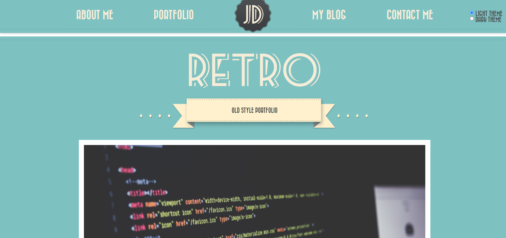

# Retro portfolio
#### For this project I used:
* __HTML__
* __CSS__
* __SCSS__
* __JS__
#### Features of the site:
- _Responsive_
- _Preloader_
- _Ability to change the light or dark theme. The dark theme is automatically set after 12 midnight and until 6 am_
- _There are phantom projects on the site that can be selected using a filter. Also, the output of projects is automatically sorted by the time of project creation. Sorting and filtering is done using JSON data_
- _After a certain period of inactivity, the site asks if the user is still here_
- _Weather parser at the end of the page_ 
\
\
[Link on this website](https://k-a-webdev.github.io/Retro-portfolio/)
\

